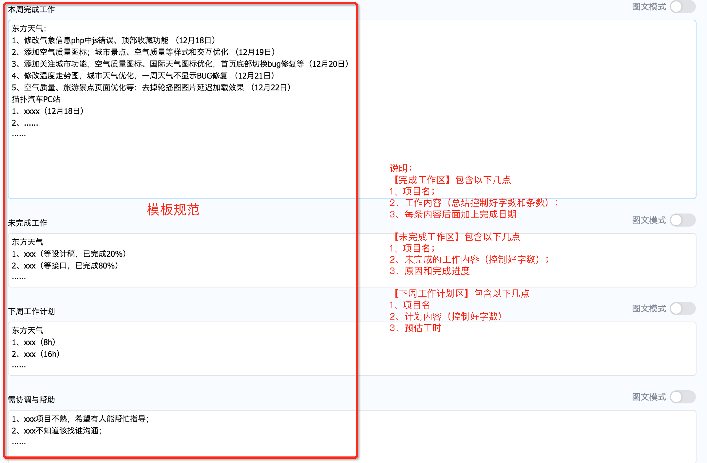

# 前端团队规范

## 背景

- 前端团队不断的壮大；
- 项目越来越多、业务越来越复杂；
- 前端管理、维护越来越困难。

## 目的

提升前端团队开发效率，降低前端团队维护成本。

## 开发工具

- **[VsCode（必须）](https://code.visualstudio.com/)**
- Sublime Text（[CN](http://www.sublimetextcn.com/) [EN](https://www.sublimetext.com/)）
- [Atom](https://atom.io/)

## 开发环境：

- [node（下载最新 lts 版本）](https://nodejs.org/en/)（**请使用 nvm 来管理 node 版本：[nvm for windows](https://github.com/coreybutler/nvm-windows#node-version-manager-nvm-for-windows)、[nvm for mac & linux](https://github.com/creationix/nvm)**）
- [npm](https://github.com/npm/cli)（一般随 node 一起安装）
- [git](https://git-scm.com/)

## 编码规范

**请直接按照此教程来配置代码开发规范：** [VsCode 开发环境配置规范](./vscode_eslint_prettier.md)

如发现下面列出的规范与上面 VsCode 配置的规范有冲突，以上面配置的为准。

1. [git 规范](./git.md)
2. [目录和命名规范](./dir.md)
3. [HTML 编码规范](./html.md)
4. [CSS 编码规范](./css.md)
5. [JavaScript 编码规范 1](./javascript.md) - ~~[JavaScript 编码规范 2](./js.md)~~
6. [README 文件规范](./project_readme.md)
7. [上线规范](./online.md)
8. ~~[测试服使用规范](./server.md)~~

## 公共 js 库

针对公司业务整理的公共 js 库（未经过全面测试验证，有问题可以提工单或提合并请求参与维护）：

- [shfe-lib](http://codeio.dftoutiao.com/RESEARCH/shfe-lib/src/master/README.md)：适用于 H5 和 APP 开发，PC 不考虑兼容低版本浏览器也可以使用。
- [public-lib](http://codeio.dftoutiao.com/DFTTPC/public-lib/src/master/README.md): 适用于 PC 开发。

## 日报、周报、月报规范

为了更好的管理日报、周报、月报，节约大家时间，特整理出此日报、周报、月报规范，请务必按要求填写。

### 日报【建议】

> 为了减轻大家工作量，日报暂不做强制要求，但是希望大家养成记日志的习惯，可以钉钉提交记录也可以用自己常用的记事本记录，方便日后自己做总结。

### 周报【必须】

### 月报【必须】

月报模板就不出示例了，可参考周报模板适当调整。

### 关于周报、月报请务必注意以下几点

1. **项目名称清晰**（如：头条 PC、猫扑 H5、头条小程序、头条 APP-任务中心、头条 APP-xx 活动、头条 APP-xx 频道、xxx 后台系统等等）；
2. **内容简单明了清晰易懂**（切忌写流水账，不要出现重复的工作内容）；
3. **控制在 30~50 个字**（完成工作内容区每条工作内容的描述尽量不要超过 30 个字，最多不能超过 50 个字；如果觉得字数不能够完全表达出来，可以在备注中进行简单的说明）；
4. **不超过 5 条内容**（完成工作内容区每个项目下的完成工作内容条数不能超过 5 条，且每条内容后面加上完成日期（xx 月 xx 日），内容请自行概括总结，控制好字数和条数）；
5. **归纳总结**（周报（月报）是需要自己对本周（本月）的工作内容进行总结归纳的，不要把日报（周报）内容复制在一起形成周报（月报）发过来）；
6. 如发现不符合要求的，将会影响考核。

## 注意

- **每个人请务必遵守此规范**，如有问题请及时反馈。
- 规范正在不断的完善中，如发现有错误、疑问、建议，可以提 PR 或者反馈给[李志高](mailto:lizhigao@021.com)

## 附

- [MarkDown 语法学习](./markdown.md)
- [前端工具集](./tools.md)
