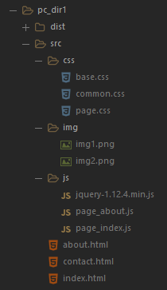
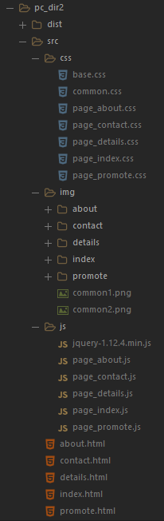

# 目录规范

## 命名规则

尽量使用 `英文单词` 命名（如：index、about、contact 等），`避免使用汉语拼音` 命名（如：shouye、guanyu、lianxiwomen 等）

### 项目命名

全部采用小写方式，超过一个单词的时以减号`-`连接。

- 例：dftth5-cm

### 目录命名

尽量采用小写方式，超过一个单词的时候使用下划线`_`连接。

- 例：about_us、contact_us

### JS 文件命名

全部采用小写方式，超过一个单词的时候使用下划线`_`连接。

- 例：account_model.js

### CSS, SCSS 文件命名

全部采用小写方式，超过一个单词的时候使用下划线`_`连接。

- 例：retina_sprites.scss

### HTML 文件命名

全部采用小写方式，超过一个单词的时候使用下划线`_`连接。

- 例：error_report.html

## 结构规范[参考]

- 结构（html）、样式（css）、行为（js）分离，不到迫不得已，请不要将 css 和 js 代码写到 html 文件中。
- 对于简单的项目（两三个页面，样式、业务逻辑简单），可参考[目录结构一](./template/pc_dir1)，结构如下图：

- 对于复杂的项目（页面数量较多，样式、业务逻辑比较复杂），可参考[目录结构二](./template/pc_dir2), 结构如下图：

**注意：以上只是列出了两个最基本的参考结构，对于使用框架、构建工具或者脚手架的项目，目录结构应根据实际情况而定，这个后续再完善到规范中。**
