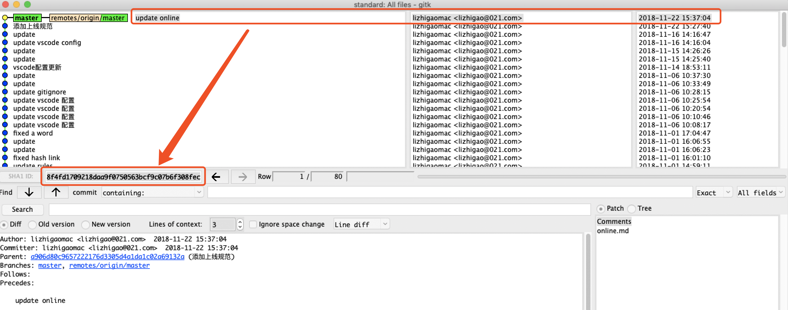
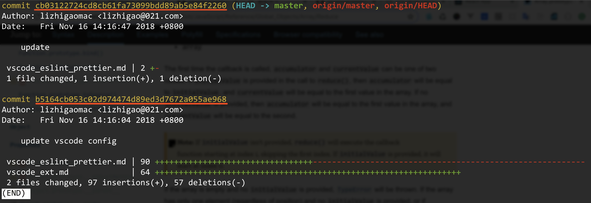

# 上线规范

## 上线申请

开发者代码经过自测以及测试组、产品测试验证没问题可以上线时，找相关负责人上线，请按此格式发送上线申请：

- 针对非 PR（合并请求）形式上线的项目：

```bash
操作：上线（或测试）
url：https://resources.dftoutiao.com/xxx/xxx.html
仓库：http://codeio.dftoutiao.com/xxx.git
分支：master
版本号：cb03122724cd8cb61fa73099bdd89ab5e84f2260  # 此版本号为项目中git版本号，测试发布时可以不用指定版本号
目录文件：/dist （或/dist/xxx.js）  # 指定具体需要同步上线的目录或文件
修改内容：
1、解决xxxbug；
2、完成xxx需求；
……
```

- 针对提 PR（合并请求）形式上线的项目：

```bash
操作：上线（或测试）
url：https://resources.dftoutiao.com/xxx/xxx.html
仓库：http://codeio.dftoutiao.com/xxx.git
分支：master
PR：http://codeio.dftoutiao.com/xxx/pulls/186  # 合并请求地址，如：http://codeio.dftoutiao.com/DFTTH5/dftth5/pulls/186
目录文件：/dist （或/dist/xxx.js）  # 指定具体需要同步上线的目录或文件
修改内容：
1、解决xxxbug；
2、完成xxx需求；
……
```

注意：

- 如项目初次发布，不确定 url 时，找相关负责人确定。
- **上线操作必须填写版本号或 PR 地址**

## 上线操作

负责人上线时注意：

1. 检查上线的版本号和上线地址是否正确；
2. 上线完成之后回复开发者进行线上验证。

## 如何查看 git 版本号

1、通过`gitk`工具查看：



2、通过`git log`命令查看（如查看最近两次提交记录日志：`git log --stat -2`）：



> 更多 git log 用法，请点击：[查看提交历史](https://git-scm.com/book/zh/v1/Git-%E5%9F%BA%E7%A1%80-%E6%9F%A5%E7%9C%8B%E6%8F%90%E4%BA%A4%E5%8E%86%E5%8F%B2)、[Viewing the Commit History](https://git-scm.com/book/en/v2/Git-Basics-Viewing-the-Commit-History)、[git-log](https://git-scm.com/docs/git-log)
